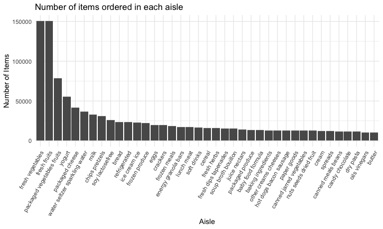
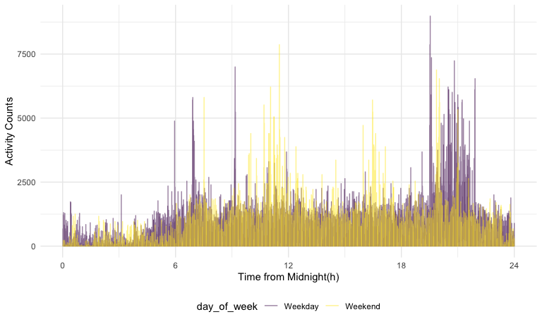

Solutions for Homework 3
================
Jiajun Tao
2022-10-15

### Problem 1

We first read in the data.

``` r
data("instacart")

instacart = 
  instacart %>% 
  as_tibble(instacart)
```

This dataset has 1384617 rows and 15 columns. The variables include
order_id, product_id, add_to_cart_order, reordered, user_id, eval_set,
order_number, order_dow, order_hour_of_day, days_since_prior_order,
product_name, aisle_id, department_id, aisle, department. To be
specific, `product_id` and `product_name` refer to what products been
ordered, `aisle_id` and `aisle` refer to where the products are, and
`department_id` and `department` refer to which department the products
belong to. The observations document the order id, the user id, how many
products in the order, what are the products, where are the products,
whether is reordered or not, and so on. In total, there are 39123
products found in 131209 orders from 131209 distinct users.

``` r
instacart %>% 
  count(aisle) %>% 
  arrange(desc(n))
```

    ## # A tibble: 134 × 2
    ##    aisle                              n
    ##    <chr>                          <int>
    ##  1 fresh vegetables              150609
    ##  2 fresh fruits                  150473
    ##  3 packaged vegetables fruits     78493
    ##  4 yogurt                         55240
    ##  5 packaged cheese                41699
    ##  6 water seltzer sparkling water  36617
    ##  7 milk                           32644
    ##  8 chips pretzels                 31269
    ##  9 soy lactosefree                26240
    ## 10 bread                          23635
    ## # … with 124 more rows

There are 134 aisles, and fresh vegetables and fresh fruits aisles are
the most items ordered from.

Then we make a plot to show the number of items ordered in each aisle.

``` r
instacart %>% 
  count(aisle) %>% 
  filter(n > 10000) %>% 
  mutate(aisle = fct_reorder(aisle,-n)) %>% 
  ggplot(aes(x = aisle, y = n)) +
  geom_bar(stat = 'identity') +
  labs(
    title = "Number of items ordered in each aisle",
    x = "Aisle",
    y = "Number of Items") +
  theme(axis.text.x = element_text(angle = 60, hjust = 1))
```



Next table shows the three most popular items in aisles
`baking ingredients`, `dog food care`, and `packaged vegetables fruits`.

``` r
instacart %>% 
  filter(aisle %in% c("baking ingredients", "dog food care", "packaged vegetables fruits")) %>% 
  group_by(aisle) %>% 
  count(product_name) %>% 
  mutate(popular_rank = min_rank(desc(n))) %>%
  filter(popular_rank < 4) %>% 
  arrange(aisle, popular_rank) %>% 
  knitr::kable()
```

| aisle                      | product_name                                  |    n | popular_rank |
|:---------------------------|:----------------------------------------------|-----:|-------------:|
| baking ingredients         | Light Brown Sugar                             |  499 |            1 |
| baking ingredients         | Pure Baking Soda                              |  387 |            2 |
| baking ingredients         | Cane Sugar                                    |  336 |            3 |
| dog food care              | Snack Sticks Chicken & Rice Recipe Dog Treats |   30 |            1 |
| dog food care              | Organix Chicken & Brown Rice Recipe           |   28 |            2 |
| dog food care              | Small Dog Biscuits                            |   26 |            3 |
| packaged vegetables fruits | Organic Baby Spinach                          | 9784 |            1 |
| packaged vegetables fruits | Organic Raspberries                           | 5546 |            2 |
| packaged vegetables fruits | Organic Blueberries                           | 4966 |            3 |

Finally we make a table showing the mean hour of the day at which Pink
Lady Apples and Coffee Ice Cream are ordered on each day of the week.

``` r
instacart %>% 
  filter(product_name %in% c("Pink Lady Apples", "Coffee Ice Cream")) %>% 
  group_by(product_name, order_dow) %>% 
  summarise(mean_hour = mean(order_hour_of_day)) %>% 
  mutate(
    order_dow = recode(order_dow,
                       "0" = "Sunday",
                       "1" = "Monday",
                       "2" = "Tuesday",
                       "3" = "Wednesday",
                       "4" = "Thursday",
                       "5" = "Friday",
                       "6" = "Saturday")
  ) %>% 
  pivot_wider(
    names_from = "order_dow",
    values_from = "mean_hour"
  ) %>% 
  knitr::kable(digit = 2)
```

| product_name     | Sunday | Monday | Tuesday | Wednesday | Thursday | Friday | Saturday |
|:-----------------|-------:|-------:|--------:|----------:|---------:|-------:|---------:|
| Coffee Ice Cream |  13.77 |  14.32 |   15.38 |     15.32 |    15.22 |  12.26 |    13.83 |
| Pink Lady Apples |  13.44 |  11.36 |   11.70 |     14.25 |    11.55 |  12.78 |    11.94 |

We could find that Pink Lady Apples are generally purchased slightly
earlier in the day than Coffee Ice Cream except Friday.

### Problem 2

We first load and tidy the data. We add an variable to indicate whether
the day is weekday or weekend.

``` r
accel_df = 
  read_csv("data/accel_data.csv") %>% 
  janitor::clean_names() %>% 
  pivot_longer(
    activity_1:activity_1440,
    names_to = 'minute',
    values_to = 'activity_counts',
    names_prefix = 'activity_'
  ) %>% 
  mutate(
    minute = as.integer(minute),
    day = factor(day, levels = c("Monday", "Tuesday", "Wednesday", "Thursday", "Friday", "Saturday", "Sunday")),
    day_of_week = case_when(
      day == "Saturday" | day == "Sunday" ~ "Weekend",
      day != "Sunday" & day != "Saturday" ~ "Weekday",
      TRUE ~ ""
    )
  )

accel_df
```

    ## # A tibble: 50,400 × 6
    ##     week day_id day    minute activity_counts day_of_week
    ##    <dbl>  <dbl> <fct>   <int>           <dbl> <chr>      
    ##  1     1      1 Friday      1            88.4 Weekday    
    ##  2     1      1 Friday      2            82.2 Weekday    
    ##  3     1      1 Friday      3            64.4 Weekday    
    ##  4     1      1 Friday      4            70.0 Weekday    
    ##  5     1      1 Friday      5            75.0 Weekday    
    ##  6     1      1 Friday      6            66.3 Weekday    
    ##  7     1      1 Friday      7            53.8 Weekday    
    ##  8     1      1 Friday      8            47.8 Weekday    
    ##  9     1      1 Friday      9            55.5 Weekday    
    ## 10     1      1 Friday     10            43.0 Weekday    
    ## # … with 50,390 more rows

The resulting dataset `accel_df` has 50400 rows and 6 columns. The
variables include week, day_id, day, minute, activity_counts,
day_of_week. It shows the activity counts of each minute during 35 days.

We then aggregate across minutes to create a total activity variable for
each day, and create a table showing these totals.

``` r
accel_df %>% 
  group_by(week,day) %>% 
  summarise(total_activity = sum(activity_counts)) %>% 
  pivot_wider(
    names_from = day,
    values_from = total_activity
  ) %>% 
  knitr::kable()
```

| week |    Monday |  Tuesday | Wednesday | Thursday |   Friday | Saturday | Sunday |
|-----:|----------:|---------:|----------:|---------:|---------:|---------:|-------:|
|    1 |  78828.07 | 307094.2 |    340115 | 355923.6 | 480542.6 |   376254 | 631105 |
|    2 | 295431.00 | 423245.0 |    440962 | 474048.0 | 568839.0 |   607175 | 422018 |
|    3 | 685910.00 | 381507.0 |    468869 | 371230.0 | 467420.0 |   382928 | 467052 |
|    4 | 409450.00 | 319568.0 |    434460 | 340291.0 | 154049.0 |     1440 | 260617 |
|    5 | 389080.00 | 367824.0 |    445366 | 549658.0 | 620860.0 |     1440 | 138421 |

We can see 2 observations show the total activity counts are 1440 with 1
for each minute. That may be a mistake or the patient just did not wear
the accelerometers on that day. To be honest, I did not see any trends
according to the table because the data fluctuates greatly. Maybe the
mean total activity counts is around 300K or 400K, but we need further
information to make judgement.

The single-panel plot below shows the 24-hour activity time courses for
each day and use color to indicate day of the week.

``` r
accel_df %>% 
  ggplot(aes(x = minute, y = activity_counts, color = day_of_week)) +
  geom_line(alpha = .5) +
  scale_x_continuous(
    breaks = c(0, 360, 720, 1080, 1440),
    labels = c("0", "6", "12", "18", "24")
  )+
  labs(
    x = "Time from Midnight(h)",
    y = "Activity Counts",
  ) 
```



Based on this graph, generally the activity counts are low during the
first 6 hours of a day because of sleeping. The activity counts of
weekday is higher in the evening like 19:00 to 22:00, and the activity
counts of weekend peek in the noon and afternoon about 17:00.
